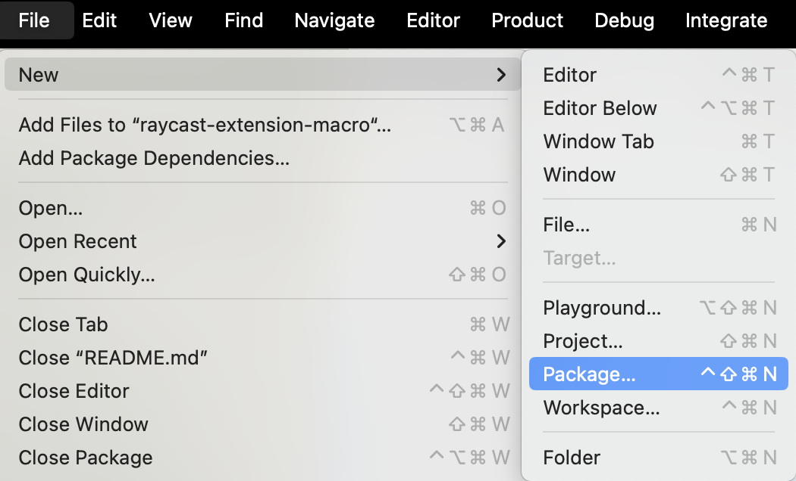
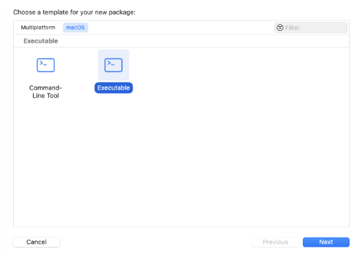
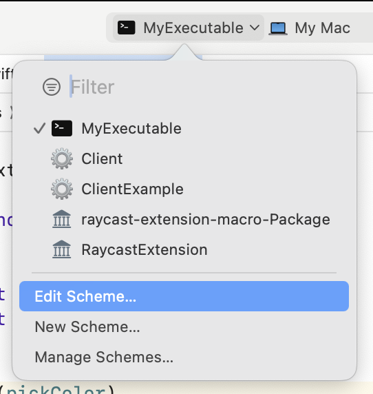
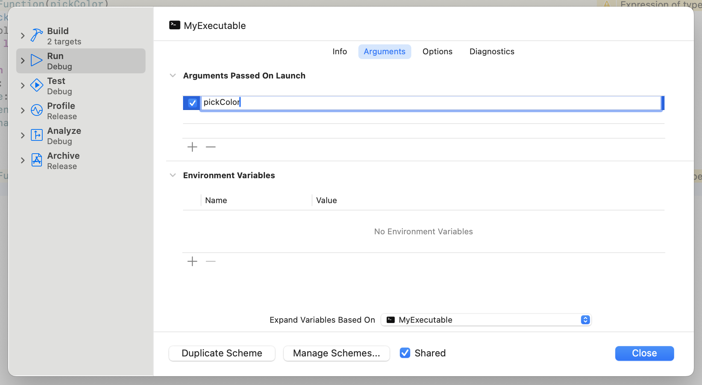

# RaycastExtensionMacro

_Import a Swift package directly into a [Raycast](https://raycast.com) extension's code and call any exposed Swift function from it_

### Why?

This new feature brings a host of benefits, including:

1.  The ability to leverage native macOS APIs: This opens up a whole slew of opportunities for creating extensions that are deeply integrated into macOS.
2.  Avoidance of language barrier: Since developers can use Swift, there's no need to learn how to manipulate native macOS APIs using another language.
3.  Ease of use: Thanks to this helper library, you won’t have to worry about the complexities of the underlying system. All you need to focus on is the Swift code.

### Requirements

- Xcode 15+

### Getting Started

We are going to assume that you have created (or forked) a Raycast extension. If you haven't, see [this guide](https://developers.raycast.com/basics/create-your-first-extension).

Let's start by creating a new `Executable` Swift `Package` in the folder of your Raycast extension. To do so, open up XCode and select `File > New > Package…`. You can create it wherever you want inside it but I like to put it in a `swift` folder next to the existing `src` folder.

> Do not forget to **untick** the "Create Git repository on my Mac" during the creation process.




We can now add this package as a dependency by updating the `Package.swift` file

```diff
// swift-tools-version: 5.9

import PackageDescription

let package = Package(
    name: "MyExecutable",
+    platforms: [.macOS(.v12)],
+    dependencies: [
+      .package(url: "https://github.com/raycast/raycast-extension-macro", from: "0.1.0")
+    ],
    targets: [
        .executableTarget(
            name: "MyExecutable",
+            dependencies: [
+              .product(name: "RaycastExtensionMacro", package: "raycast-extension-macro"),
+            ]
        ),
    ]
)
```

Now we are ready to write the functions that we want to expose the Raycast extension.

For this example, we will write one async function that returns an [`Encodable`](https://developer.apple.com/documentation/swift/encodable) but you can write as many as you want and of [different types](#supported-functions).

In the `Sources/main.swift` file:

```swift
import AppKit

struct Color: Encodable {
  let red: Int
  let blue: Int
  let green: Int
  let alpha: Int
}

func pickColor() async -> Color? {
  let colorSampler = NSColorSampler()
  guard let color = await colorSampler.sample() else { return nil }

  return Color(
    red: lroundf(Float(color.redComponent) * 0xFF),
    blue: lroundf(Float(color.blueComponent) * 0xFF),
    green: lroundf(Float(color.greenComponent) * 0xFF),
    alpha: lroundf(Float(color.alphaComponent) * 0xFF)
  )
}
```

Now if you try to run this, nothing will happen. We need to expose it:

```diff
import AppKit
+ import RaycastExtensionMacro

struct Color: Encodable {
  let red: Int
  let blue: Int
  let green: Int
  let alpha: Int
}

// Export the function that you want to use in your Raycast extension
+ #exportFunction(pickColor)
func pickColor() async -> Color? {
  let colorSampler = NSColorSampler()
  guard let color = await colorSampler.sample() else { return nil }

  return Color(
    red: lroundf(Float(color.redComponent) * 0xFF),
    blue: lroundf(Float(color.blueComponent) * 0xFF),
    green: lroundf(Float(color.greenComponent) * 0xFF),
    alpha: lroundf(Float(color.alphaComponent) * 0xFF)
  )
}

// Once all the functions have been exported, run the program
+ #handleFunctionCall()
```

> You'll see some `Expression of type 'Bool' is unused` warning on the lines of the `#exportFunction` - you can safely ignore them. This is a technical limitation until [CodeItem macros](https://github.com/apple/swift-evolution/blob/main/proposals/0397-freestanding-declaration-macros.md#code-item-macros) are released in Swift.

To be able to test it, we have to edit the scheme and pass `pickColor` (the name of the function we want to execute) as an argument.




Running the project should now show the color picker and the program should end after a color was picked.

> The first time you run the project, you'll be asked to enable macros. This is required for this library to generate the code needed to communicate with the Raycast extension.

Jumping back into your extension's code, you can call the exposed methods from the Swift package with

```ts
import { pickColor } from "swift:../swift/color-picker";

type Color = {
  alpha: number;
  red: number;
  green: number;
  blue: number;
};

export default async function command() {
  const color = await pickColor<Color | undefined>();

  console.log(color);
}
```

Done 🎉

### Supported Functions

You can expose a bunch of different types of functions using the `#exportFunction(function)` macro but there are some restrictions:

- The function can accept at most one argument. That argument has to be [`Decodable`](https://developer.apple.com/documentation/swift/decodable) or a valid JSON entity (eg. something that can be a result of [`JSONSerialization.jsonObject(with: data, options: .fragmentsAllowed)`](https://developer.apple.com/documentation/foundation/jsonserialization/1415493-jsonobject))
- The function can return a value. That argument has to be [`Encodable`](https://developer.apple.com/documentation/swift/encodable) or a valid JSON entity (eg. [`JSONSerialization.data(withJSONObject: result, options: .fragmentsAllowed)`](https://developer.apple.com/documentation/foundation/jsonserialization/1413636-data) should succeed).

#### Valid function signatures

- `() -> Void`
- `() throws -> Void`
- `() async -> Void`
- `() async throws -> Void`
- `(Any?) -> Void`
- `(Any?) throws -> Void`
- `(Any?) async -> Void`
- `(Any?) async throws -> Void`
- `() -> Any?`
- `() throws -> Any?`
- `() async -> Any?`
- `() async throws -> Any?`
- `(Input) -> Any?`
- `(Input) throws -> Any?`
- `(Input) async -> Any?`
- `(Input) async throws -> Any?`
